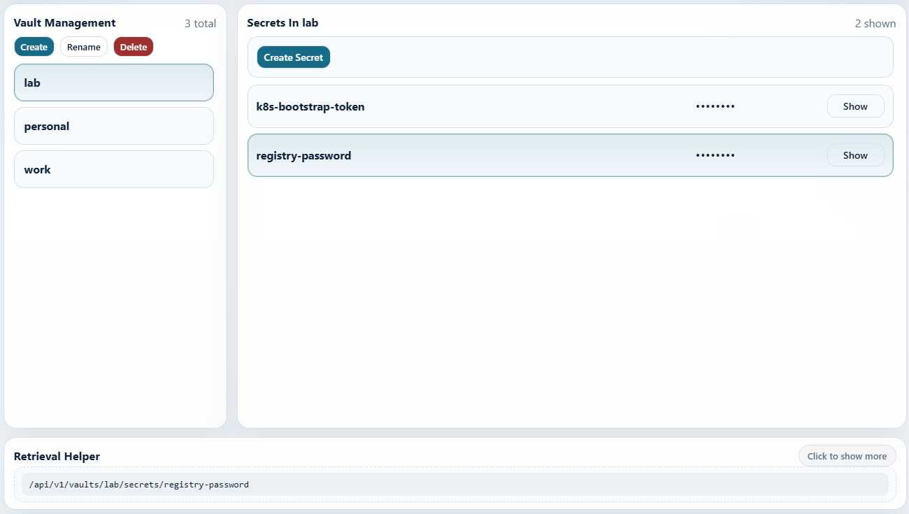
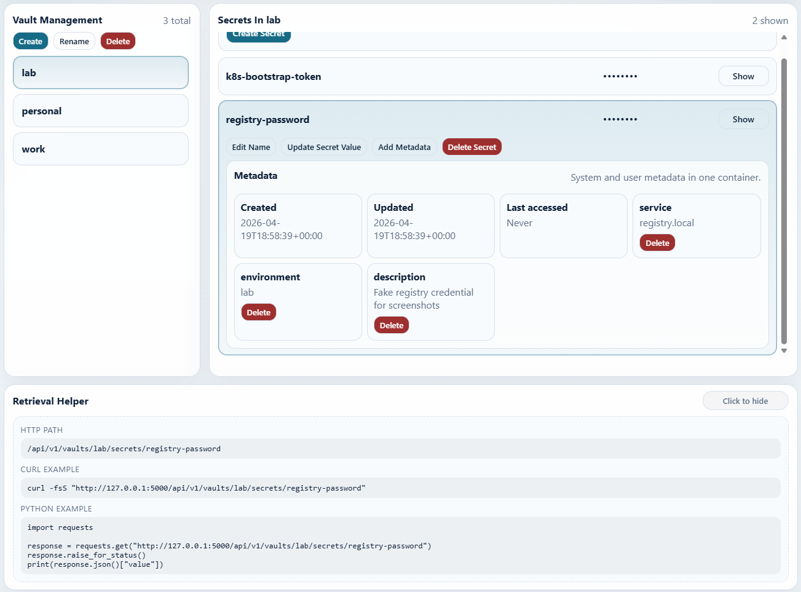

# Local Secrets Manager

Local Secrets Manager is a local file-based secrets manager with a Flask web UI and a local HTTP API. I built it as a portfolio project to explore practical secret-handling workflows for development, testing, and self-hosted learning.

## Why I built it

This project began as my **CS50 Introduction to Python final project**.

I started building it after accidentally exposing an API key on GitHub, which pushed me to create a safer local workflow for storing and retrieving secrets during development.

The current version expands that original backend into a larger Flask application with a browser UI, session controls, runtime logging, local API endpoints, automated tests, and containerized runtime support.

It was developed as a hands-on learning and portfolio project using a mix of personal implementation, documentation, and AI-assisted development. My focus was on understanding the architecture, trade-offs, and workflow rather than writing every part from scratch.

## What it does

- Organizes secrets into named vaults
- Stores secret values with optional custom metadata
- Tracks system metadata such as created, updated, and last-accessed timestamps
- Provides a local browser UI for browsing, editing, and temporarily revealing secrets
- Generates retrieval helper examples for HTTP path, curl, and Python requests
- Exposes local API endpoints for reading secrets and metadata
- Supports encrypted persistent storage
- Includes session locking, timeout controls, and runtime activity logging

## Architecture at a glance

- **Backend:** Python + Flask
- **Persistence:** local encrypted storage with app-managed metadata
- **UI:** server-rendered HTML, CSS, and JavaScript
- **API:** local read endpoints under `/api/v1/...`
- **Session model:** lock/unlock state, timeout-based auto-lock, runtime log
- **Testing:** Pytest + Behave
- **Container demo:** Docker + Gunicorn

## Runtime model and Gunicorn workers

This project keeps its active session state in memory inside the running Python process. That includes:

- lock and unlock state
- inactivity timeout tracking
- the user-visible runtime log
- the in-memory database notice shown after initialize or reset actions

That design fits the scope of this project because it is a local secrets manager intended for one local session at a time.

Flask's built-in development server typically runs as a single process, so the in-memory session state appears stable there. Gunicorn is different: if you run multiple worker processes, each worker creates its own `SecretsService` and its own `SessionState`. Those worker-local states are not shared with each other.

In practice, multi-worker Gunicorn can make the UI feel inconsistent:

- one request may hit a worker that is unlocked while the next request hits a worker that is still locked
- timeout countdowns may disagree between requests
- the runtime log may appear to lose or reorder events because each worker only sees its own in-memory history

For that reason, the default Gunicorn configuration in this repository is intentionally single-worker. Threads remain configurable, but `workers` now defaults to `1` for predictable behavior.

If true multi-worker support is ever needed, the session/runtime state would need to move out of process-local memory into shared storage.

## Screenshots

Collapsed secret and retrieval helper preview:



Expanded secret and retrieval helper outputs:



## Project scope

This project is intended for **local development, experimentation, and portfolio use**. It is **not** a production-grade secrets platform and it is **not** a replacement for tools such as HashiCorp Vault, cloud secret managers, or enterprise password managers.

When you run `python main.py`, Flask starts its built-in development server. The warning about the development server is expected in that mode and is accurate. This project now keeps that path on purpose for local debugging, while the Docker setup and the local Gunicorn launch path run the app behind Gunicorn instead.

## Running locally

### Flask development server

Use this mode when you want the simplest debug-friendly startup path in VS Code or from the terminal. This is the path that prints:

`WARNING: This is a development server. Do not use it in a production deployment.`

That warning appears because `main.py` calls `app.run(...)`, which is Flask's built-in server. That is acceptable for development and debugging, but it is not the same runtime model used by Gunicorn.

```bash
pip install -r requirements.txt
python main.py
```

VS Code launch names for this path:

- `Run Local Secrets Manager (Flask Dev, Local Only)`
- `Run Local Secrets Manager (Flask Dev, Network Testing)`

Those launches keep support for `APP_HOST`, `APP_PORT`, and `APP_DATA_DIR`.

### Local runtime with Gunicorn

Use this mode when you want a more realistic local runtime that matches the container entrypoint more closely. This path uses the existing app factory target, `app.main:create_app()`, together with `gunicorn_conf.py`.

```bash
gunicorn --config gunicorn_conf.py "app.main:create_app()"
```

By default, `gunicorn_conf.py` starts Gunicorn with `1` worker. That is intentional for this app's in-memory session model. You can still override the values with environment variables such as `GUNICORN_WORKERS` and `GUNICORN_THREADS`, but using more than one worker is unsafe with the current design because each worker will keep its own lock state, timeout state, and runtime log.

You can point Gunicorn at a specific local data directory with the same environment variables used by the Flask dev path:

```bash
APP_HOST=127.0.0.1 APP_PORT=5000 APP_DATA_DIR=data gunicorn --config gunicorn_conf.py "app.main:create_app()"
```

VS Code launch names for this path:

- `Run Local Secrets Manager (Gunicorn, Local Only)`
- `Run Local Secrets Manager (Gunicorn, Network Testing)`

### Docker

Use Docker when you want the packaged containerized runtime. The image starts Gunicorn, and `docker-compose.yml` mounts `./data` into `/app/data` so secrets persist locally between runs.

```bash
docker-compose up --build
```

Then open the local address shown in the terminal.

## Which launch mode to use

- Use `Flask Dev` when you are stepping through code, setting breakpoints, or doing day-to-day debugging.
- Use `Gunicorn` when you want a realistic local runtime without Flask's built-in development server warning. The repository defaults Gunicorn to a single worker so its in-memory session state stays consistent.
- Use Docker when you want the same containerized Gunicorn-based setup documented by the project.

## Demo seed data for screenshots and walkthroughs

To generate a clean demo dataset with fake sample secrets:

```bash
python scripts/seed_demo.py
```

That creates demo data under `data/demo/` by default, replaces any previous demo dataset in that folder, and prints the demo passphrase.

You can also choose a custom data directory:

```bash
APP_DATA_DIR=data/demo python scripts/seed_demo.py --passphrase demo-passphrase
```

The screenshots in `docs/screenshots/` are committed sample assets for the README. The seed script recreates demo data for walkthroughs and screenshots, but it does not generate image files by itself.

## Running tests

```bash
pytest
```

Behavior tests:

```bash
behave
```

Combined coverage for both test suites:

```bash
coverage erase
coverage run -m pytest
coverage run -a -m behave
coverage report -m
```

Optional HTML coverage output:

```bash
coverage html
```

## VS Code test tooling

VS Code's Python Testing integration keeps normal `pytest` discovery working in this repository, but the built-in `Run Tests with Coverage` action only runs the configured Python test provider. In this project that means `pytest`, not `behave`, so Behave scenarios are not included in that coverage run.

To generate one combined coverage report for both `pytest` and `behave` from VS Code, run:

- `Tasks: Run Task` -> `Tests: Combined Coverage`
- `Tasks: Run Task` -> `Tests: Combined Coverage + HTML`

Those tasks run from the workspace root and execute:

```bash
coverage erase
coverage run -m pytest
coverage run -a -m behave
coverage report -m
coverage html
```

Use the built-in VS Code test UI when you want normal `pytest` discovery and execution. Use the coverage tasks when you want a project-supported combined report that includes both automated test suites.

## Current highlights

- Server-rendered UI with multi-expand secret cards
- Selectable metadata container and metadata fields
- Retrieval helper that tracks the selected secret or metadata target
- Temporary secret reveal fetched fresh from the backend
- Session timeout and auto-lock controls
- Runtime log for user-visible session activity
- Dockerized demo setup using Gunicorn

## Security and honesty notes

- This is a **local app**, not a hosted multi-user service.
- It currently favors clarity and local usability over enterprise hardening.
- The included Docker setup is useful for demos, but it does **not** turn the app into a production-ready deployment.
- Gunicorn is configured for a single worker by default because multi-worker mode is inconsistent with the current in-memory session and runtime state design.
- Revealed secret values are fetched fresh and automatically hidden again, but this should still be treated as a local-development convenience feature.

## Future improvements

- Stronger authentication and authorization options
- Safer production deployment patterns
- Better API documentation and richer screenshots
- Optional OS keyring integration for safer local unlock flows
- Additional audit and export controls for secret access

## Project background

The original project started as a Python secret-management backend/library. This repository represents the next stage of that work: turning the original idea into a more complete local application with a UI and API while keeping the scope honest and practical.
